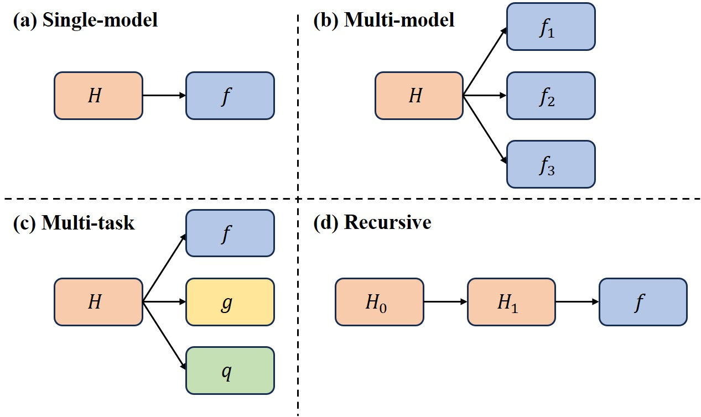
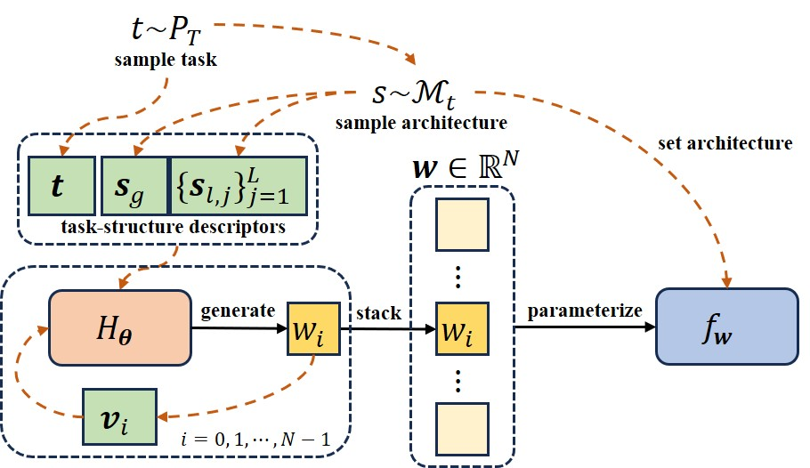
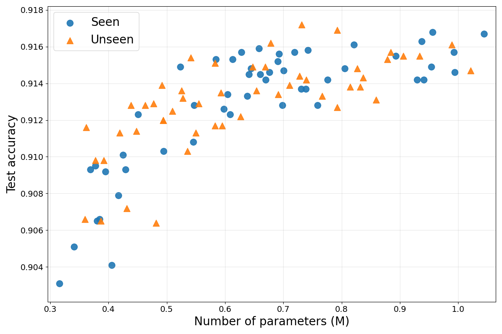

# Universal Hypernetworks for Arbitrary Models

Official implementation of **Universal Hypernetworks for Arbitrary Models** by Xuanfeng Zhou.

- Paper (arXiv): https://arxiv.org/abs/2604.02215
- Email: xuanfeng.zhou.research@gmail.com, zxf12138@buaa.edu.cn

## Overview
> A fixed-architecture hypernetwork that generates parameters for diverse target models, tasks, and modalities.

Conventional hypernetworks are typically engineered around a specific base-model parameterization, so changing the target architecture often requires redesigning the hypernetwork and retraining it from scratch.

We introduce **Universal Hypernetwork (UHN)**, a fixed-architecture generator that predicts weights from deterministic parameter, architecture, and task descriptors.
This descriptor-based formulation decouples generator architecture from target-network parameterization, enabling a single generator to instantiate heterogeneous models across the tested architecture and task families.

Our empirical claims are threefold:
1. One fixed UHN remains competitive with direct training across vision, graph, text, and formula-regression benchmarks.
2. The same UHN supports both multi-model generalization within a family and multi-task learning across heterogeneous models.
3. UHN enables stable recursive generation with up to three intermediate generated UHNs before the final base model.


*Generation settings investigated in our UHN experiments:*

- **(a) Single-model:** UHN $H$ generates one base model $f$.
- **(b) Multi-model:** UHN $H$ generates a set of base models $\{f_i\}$ within one model family.
- **(c) Multi-task:** UHN $H$ generates base models $f, g, q, \ldots$ for different tasks across potentially heterogeneous architectures.
- **(d) Recursive generation:** Root UHN $H_0$ generates an intermediate UHN $H_1$, which then generates base model $f$.

## Method at a Glance


We sample the task and architecture of the base model $f_{\mathbf{w}}$ and collect their task-structure descriptors. For each parameter in $f_{\mathbf{w}}$, we collect its index descriptor $\mathbf{v}_{i}$ and feed it into UHN $H_{\boldsymbol{\theta}}$ along with task-structure descriptors to obtain each individual weight $w_{i}$ of $f$. These weights are then stacked into the weight vector $\mathbf{w}$, which parameterizes $f_{\mathbf{w}}$.

## System Requirements
### Hardware
- **GPU**: NVIDIA GeForce RTX 4090 (24GB VRAM)

### Software
- **Operating System**: Ubuntu 20.04
- **Package Manager**: Conda
- **CUDA**: 12.1-compatible

## Installation

### 1. Clone the repository
```bash
git clone https://github.com/Xuanfeng-Zhou/UHN.git
cd <repo-name>
```

### 2. Create and activate a Conda environment
```bash
# Create a new conda environment with Python 3.11.10
conda create -n uhn python=3.11.10 -y

# Activate the environment
conda activate uhn
```

### 3. Install dependencies
```bash
pip install -r requirements.txt
```

## Dataset Preparation
All datasets except text datasets (AG News and IMDB) are downloaded automatically during training.
For multi-model experiments, you need to generate model datasets first.

### Text datasets (required for AG News/IMDB experiments)
1. Create the data directory:
```bash
mkdir -p ./data && cd data
```

2. Download dataset archives manually and extract them under `./data`:
   - AG News (`archive.zip`): https://www.kaggle.com/datasets/amananandrai/ag-news-classification-dataset
   - IMDB (`aclImdb_v1.tar.gz`): https://ai.stanford.edu/~amaas/data/sentiment/

```bash
unzip -d ./ag_news archive.zip
tar -zxvf aclImdb_v1.tar.gz && mv aclImdb imdb
cd ..
```

### Generate model datasets for multi-model experiments
Generation scripts are under `./script/multi_model/generate_model_set`:

```bash
chmod 755 ./script/multi_model/generate_model_set/*.sh
./script/multi_model/generate_model_set/cnn_mix_depth_modelset_generate.sh
./script/multi_model/generate_model_set/cnn_mix_width_modelset_generate.sh
./script/multi_model/generate_model_set/cnn_mix_depth_and_width_modelset_generate.sh
./script/multi_model/generate_model_set/transformer_mix_modelset_generate.sh
```

Generated model sets are saved under `./model_datasets`.

## Training
All experiments in the paper (single-model, multi-model, multi-task, recursive-task, and ablation) can be run via scripts under `./script`.
Each experiment is automatically run 3 times with different seeds.
Outputs and logs are saved under `./runs`.

Make scripts executable before running:
```bash
find ./script/ -type f -name "*.sh" -exec chmod 755 {} \;
```

Examples:

### 1. Single-model training (`./script/single_model`)
Run a single-model experiment on MNIST/CIFAR-10 with a CNN base model:
```bash
./script/single_model/cnn_single.sh
```

### 2. Multi-model training (`./script/multi_model`)
Run the CNN Mixed Width multi-model experiment on CIFAR-10:
```bash
./script/multi_model/cnn_mix_width.sh
```

### 3. Multi-task training (`./script/multi_task`)
Run the multi-task experiment:
```bash
./script/multi_task/multitask.sh
```

### 4. Recursive generation (`./script/recursive`)
Run recursive-task experiment with one recursion:
```bash
./script/recursive/recursive_task.sh
```

Run recursive-task experiments with two and three recursions:
```bash
./script/recursive/recursive_task_multidepth.sh
```

### 5. Ablation (`./script/ablation`)
Run index-encoding ablation:
```bash
./script/ablation/ablation_index_encoding.sh
```

## Representative Results
### Multi-model Generalization (CNN Mixed Width)


To illustrate UHN generalization to held-out architectures, we show scatter plots of test performance for models in hold-in set $M'_{\mathrm{train}}$ (seen) and held-out set $M_{\mathrm{test}}$ (unseen), versus the number of trainable parameters.

### Recursive Generation (MNIST)
| Setting | Generated chain | Test accuracy |
|---|---|---:|
| Direct training | $N/A$ | 0.9837 |
| Recursive (0) | $H_0 \rightarrow f$ | 0.9841 |
| Recursive (1) | $H_0 \rightarrow H_1 \rightarrow f$ | 0.9825 |
| Recursive (2) | $H_0 \rightarrow H_1 \rightarrow H_2 \rightarrow f$ | 0.9795 |
| Recursive (3) | $H_0 \rightarrow H_1 \rightarrow H_2 \rightarrow H_3 \rightarrow f$ | 0.9741 |

We study *recursive weight generation* to test whether UHN can stably generate another UHN whose outputs are then used to instantiate a downstream task model.

We consider recursion chains of the form:
$H_0\rightarrow\cdots\rightarrow H_k\rightarrow\cdots\rightarrow H_K\rightarrow f$
where each arrow denotes “generates the weights of.” Here, all UHNs $H_k$ in the chain use the task-structure encoder, and $H_k$ for $k\ge 1$ are *generated* UHNs. Concretely, $H_0$ (the root UHN) generates the weights of $H_1$; $H_1$ generates $H_2$; and so on until $H_K$ generates the leaf base model $f$ (an MLP for MNIST classification). We evaluate recursion depths up to $K=3$.

## Citation
```bibtex
@article{zhou2026universal,
  title   = {Universal Hypernetworks for Arbitrary Models},
  author  = {Zhou, Xuanfeng},
  journal = {arXiv preprint arXiv:2604.02215},
  year    = {2026}
}
```

## License
This project is licensed under the MIT License. See [LICENSE](./LICENSE) for details.
